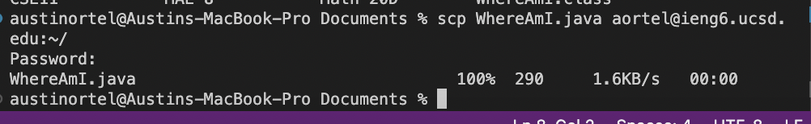

# **Week 1 Lab Report**
Hello! You're likely here because it's your first time logging into a your course specific account on `ieng6`, or maybe you've forgotten the steps and are just simply lost. To help you gain access, I have put together this tutorial!

To gain access to your account (*and learn how to use it properly*), there are **SIX** easy steps:

* Install VSCode
* Connect Remotely 
* Run Some Commands
* Transporting Files with `scp`
* Setting the SSH Key
* Optimizing Remote Running

After following these steps, you should be well on your way!

---
## **Step 1** - Install VSCode
Before you can set up a remote connection, you need access to the VScode terminal. To do this, go to the visual studio code website https://code.visualstudio.com/ and follow the instructions to download the application. I already had the app downloaded beforehand, so I skipped this step. 

Upon opening the application, you should be greeted with a screen resembling the below pictured: 

Your screen may look a little different depending on your visual settings(*for instance mines black because I chose the dark setting*) but it should work all the same!

---
## **Step 2** - Connect Remotely
Start by opening a terminal in VSCode and typing in the below command:

```
ssh cs15lfa22cl@ieng6.ucsd.edu
``` 

if that doesn't work try: 

```
ssh aortel@ieng6.ucsd.edu
``` 

If it is your first time connecting,type in yes and press enter. Then proceed by typing in your password. Once you are logged in, your terminal should look like this: 


Congratulations! You are now logged into the remote ieng6 computer.

---
## **Step 3** - Run Some Commands
Upon gaining access to the remote computer, I ran some commands to see what would be returned by the server. The first command I tired was `pwd` which returned the following: 

 

This shows the current location of the file I was dealing with. 

---
## **Step 4** - Transporting Files with SCP

This section will be teaching you how to copy a file from a client to a server. For this step of the lab, we were tasked with creating a file called `WhereAmI.java` where I coded a list of commands to return a statment listing various properties of the directory system. 

After compiling and running the file, your screen should look similar to: 


Then, in the terminal you made this file run the following command: 

```
scp WhereAmI.java cs15lfa22cl@ieng6.ucsd.edu:~/
``` 

or

```
scp WhereAmI.java aortel22@ieng6.ucsd.edu:~/
```

Just like when logging into `ssh` you should be prompted with a password. After the file is copied, your screen should look like this:



Next, log back into `ssh` and use the `ls` command. You should find the file in your home directory ready to go!

Once logged into the `ssh` if you were to compile and run the file again the output may look a little different: 


As you can see the output on the remote server looks a litle different than the local client. This is because the information about the user and file is differnet now that it is on the remote server.

--- 
## **Step 5** - Setting the SSH Key

To increase the efficiency of the login process, the next step we took involved setting the `ssh` key. 

To set this up, type the following command into your terminal:

```
ssh-keygen
```

Afterwards you will be prompted by a block of text where you will then type the `enter` key twice. 

This action creats a private key and public key in the ssh directory of your computer. Next, we need to copy the public key over to the ssh directory of your personal account. 

To do this, log back into the ssh server and type: 

```
mkdir .ssh
```

Next, logout and return to the client terminal, typing: 

```
scp /Users/Austin/Documents/ .ssh/id_rsa.pub aortel@ieng6.ucsd.edu:~/.ssh/authorized_keys/
```

After doing this, you should be able to use both the `ssh` and `scp` commands without having to worry about entering a password!

It might look something like this:


As you can see I was never prompted to enter in a password!

---
## **Step 6** - Optimizing Remote Running

In the final step, we will be taking what we learned and optimize the time it takes to make a local edit to the `WhereAmI.java` file. 

To accomplish this we can use some shortcuts. 

* Up arrow key to bring back previously written commands
* Semicolons can be used to type multiple commands on the same line 
* Copy Paste can be very useful to run multiple commands at once
* Use quotation marks arond an ssh command to run it straight on the remote server

Any combination of these techniques might look likes this: 


As you can see, I ran a list of commands in one line. Super easy and super efficient!


