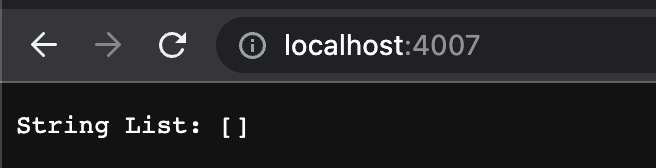
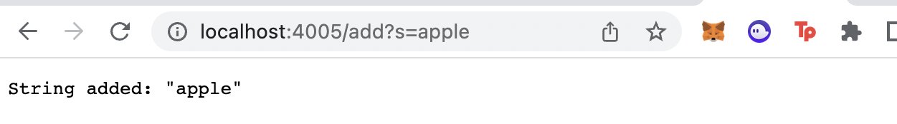
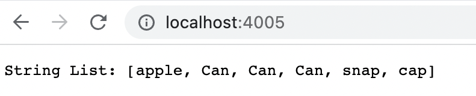
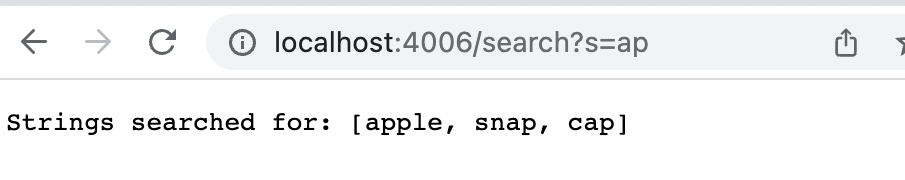
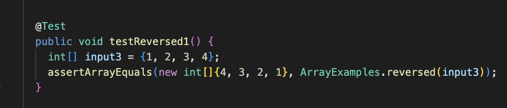
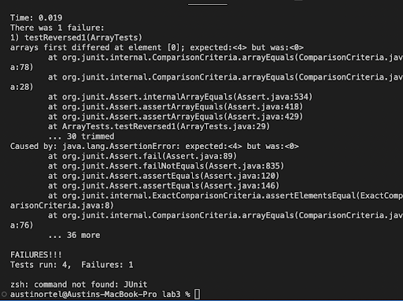
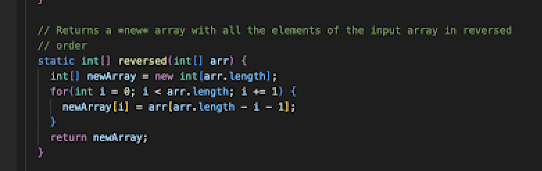
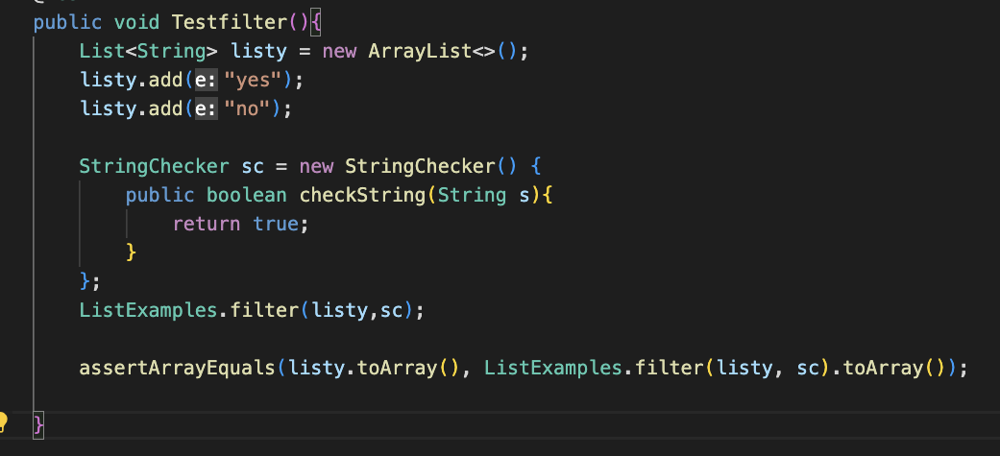
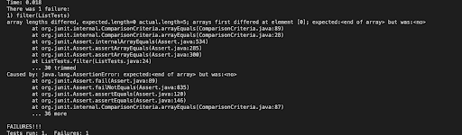
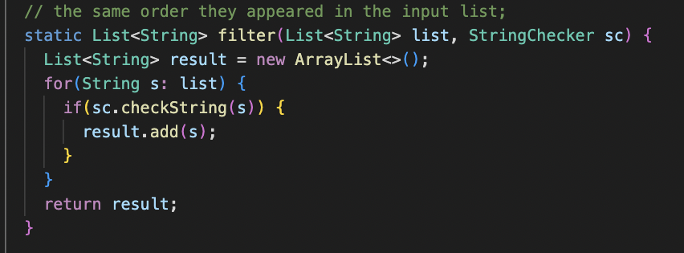

# **Lab Report 2** #
 ---
 During this weeks lab report, we worked on identifying bugs within our code, the symptoms that make us aware of these bugs, and how we can go about fixing them. 

---
## **Part 1 ~ Search Engine** ##

The following is my code for the search engine file:

```
import java.io.IOException;
import java.net.URI;
import java.util.ArrayList;

class Handler implements URLHandler {
    // The one bit of state on the server: a number that will be manipulated by
    // various requests.
    String[] list = new String[100];
    ArrayList<String> words = new ArrayList<>();

    public String handleRequest(URI url) {
        if (url.getPath().equals("/")) {
            return String.format("String List: " + words.toString());
        }
        else {
            System.out.println("Path: " + url.getPath());
            if (url.getPath().contains("/add")) {
                String[] parameters2 = url.getQuery().split("=");
                if (parameters2[0].equals("s")) {
                    words.add(parameters2[1]);
                    return String.format("String added: " + "\"" + parameters2[1] + "\"");
                }
            }

            if(url.getPath().contains("/search")){
                String[] parameters1 = url.getQuery().split("=");
                ArrayList<String> query = new ArrayList<>();
                if(parameters1[0].equals("s")){
                    for(int j = 0; j < words.size(); j++){
                        if(words.get(j).contains(parameters1[1])){
                            query.add(words.get(j));
                        }
                    }
                    return String.format("Strings searched for: " + query.toString());
                }
            }
            
            return "404 Not Found!";
        }
    }
}

class SearchEngine {
    public static void main(String[] args) throws IOException {
        if(args.length == 0){
            System.out.println("Missing port number! Try any number between 1024 to 49151");
            return;
        }

        int port = Integer.parseInt(args[0]);

        Server.start(port, new Handler());
    }
}

```

Once I compile and run the file under port `4005`, a link to my search engine website appears in the terminal that when clicked, transports you to a webpage: 




Now that the webpage is created, I can access the search bar and add strings to this list. Let's start by adding the string `Apple`. 





To add strings to the list, I type `/add?s=typestringhere` into the search bar before hitting enter and allowing the new string to join the list. 

To understand how this works lets look at the code. When I entered the above phrase into the search bar, the method `handleRequest` is called using the url as its parameter. The method will search along the url to see if it contains the key word `/add`. If the program does, a new string array is created to store the word that follows `?s=` (*in this case apple*) before it is then added to the arraylist that houses the list of strings. 

Once we add a few strings to the list, the home webpage might look something like this





where all of the strings you added are displayed.

If we take a look back into the program, we will see that when `/` is the only argument in the url after the port number, that we will arrive back to the home page and be shown all strings added to the ArrayList. The method `handleRequest` is called and since the path directs us to the home page, the ArrayList of strings is returned with all added values (*`[apple, Can, Can, Can, snap, cap]`*) as shown. 

Now let's use the search command to search within our list of strings for any strings that contain the substring `ap`. To do this, I go to the search bar and add `/search?s=ap` to the end of the url. After pressing enter, my webpage looks like this:





Looking at the code, we see that once again the `handleRequest` method is called. This time, the program reads the url and sees that `/search?s=ap` is included at the end. A new string array is created to store the substring `ap` and a new ArrayList `"query"` is created to store the strings that contain that substring. The program then checks every element of the original ArrayList(*`[apple, Can, Can, Can, snap, cap]`*) and adds all strings that contain `ap` to the new ArrayList (*`[apple, snap, cap]`*) before returning the new ArrayList. 

Now you can create any List of Strings and create your own queries!

---
## **Part 2 ~ Bugs and Symptoms** ##

The different files I will be examining are the Array Methods files, and the List Methods files. Let's start with Array Methods, specifically the `reversed` method.

I ran the following test to survey for errors: 





The symptoms that told me there was an error:





To fix this bug, I changed the program a little bit. Here was my solution:





The problem is that the `reverse` method uses an empty array, `newArray`, to fill the reversed values of `arr`. This is a problem because the only values `newArray` has is 0. That is why the symptom output shows that the expected output was `<4>` while the actual output was `<0>`.

 To fix this, I switch the positions of `newArray` and `arr` in the for loop and instead return `newArray` so that it properly stores the reversed values of `arr`. 


The next file let's look at is in List Methods, specifically the `filter` method. 

I ran the following test to survey for errors: 





The symptoms that told me there was an error:





My solution to the bug:





The problem with the `filter` method is that it is inputting the checked strings backwards instead of forwards. In the symptom output, this is shown where index [0] was `<no>` instead of the expected `<yes>`. To fix this, I changed `.add(0,s)` to just `.add(s)` so that each element will be added at the end of the list.

All debugging done!