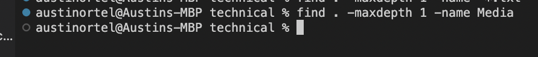

# **Lab Report 3** #
During this weeks lab report, we were tasked with exploring three different terminal command-line options that are related to one of the three terminal commands `less`, `find`, and `grep`.

---
## **First Command - maxdepth** ##

The first command I explored was the `-maxdepth n` command. Essentially, this command allows the user to limit the find search to a specific directory level. For instance: 

The above code is searching for the Meda file through every directory of technical up until a depth of two. This can be useful when looking for a group of files across different directories excluding their subdirectories. 

This image uses the same `-maxdepth` command and illustrates how varying the depth can allow access to more or less files. As you can see, when the depth is changed from two to one, no files match the `find` search. Understanding how this works can be useful when checking if a file was correctly deleted or moved to a different directory/subdirectory. 

This image uses a mix of `-maxdepth` and `-mindepth` to narrow a search to a specific set of directories. This can be super useful when searching for files that share the same name but are in different levels of directory. Setting a search boundary allows the user to curate a more accurate search for this type of data. 

---
## **Second Command - type** ##
