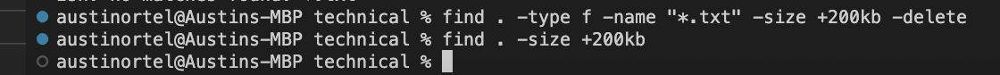

# **Lab Report 3** #
During this weeks lab report, we were tasked with exploring three different terminal command-line options that are related to one of the three terminal commands `less`, `find`, and `grep`. For this lab, I chose to focus on the `find` command.

---
## **First Command - maxdepth** ##

The first command I explored was the `-maxdepth n` command. Essentially, this command allows the user to limit the find search to a specific directory level. For instance: 

The above code is searching for the Meda file through every directory of technical up until a depth of two. This can be useful when looking for a group of files across different directories excluding their subdirectories. 

This image uses the same `-maxdepth` command and illustrates how varying the depth can allow access to more or less files. As you can see, when the depth is changed from two to one, no files match the `find` search. Understanding how this works can be useful when checking if a file was correctly deleted or moved to a different directory/subdirectory. 

This image uses a mix of `-maxdepth` and `-mindepth` to narrow a search to a specific set of directories. This can be super useful when searching for files that share the same name but are in different levels of directory. Setting a search boundary allows the user to curate a more accurate search for this type of data. 

---
## **Second Command - type** ##

The second command I explored was the `-type` command. This command is typically followed by a letter specifying the type of file it is referring to. 

This image uses the `-type f` command option to search for files within a directory, in the case above all of the files in the directory `./911report` were returned. This can be extremely useful when trying to access all of the files within a directory to make a some sort of search or edit.

This image uses the `-type d` command, which like the `-type f` command searches through the directory specified in `find` for a type of data. `-d` refers to directory, so when paired with find, every directory and subdirectory is returned in the terminal. This can be very useful when trying to understand the data you're dealing with, in particular the number of directories, the size of directories, and any other search or change you need to make to a set of directories. 

 

This image uses the `-type f -type empty` command to search the directory for any empty files. Since there are none in the technical directory, nothing was returned. While this seems like a unimportant command, it is very useful when trying to delete empty any empty files on your computer, or when trying to locate empty lock files.

---
## **Third Command - size** ##

The third command I explored was the `-size` command. This allows the user to search within a directory for files of a specified size. 

The above command searches the technical direcotry for every file above 200kb. This can be useful when trying to understand the amount of memory the data your dealing with is taking up. 

Expanding upon the previous command, `-size` also allows for lower and upper bounds to be set. The above command found all files within the size range. This can be useful when trying to target a specific range of data size within a directory.

This command shows one way in which the `-size` can be used to clear memory. All files above 200kb in data were deleted, and then I used the find command again to verify that they were indeed deleted. This is useful when trying to erase outdated and unnecessary files that no are no longer needed, or when trying to clear up space by targeting large files. 