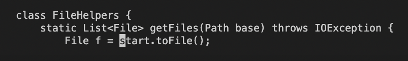
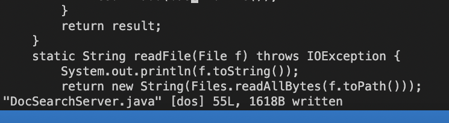

# **Lab Report 4** #
During this weeks lab report, we used the terminal command VIM to make edits to a file with max efficiency. The goal was to accomplish a list of edits in under 30 key strokes, and in under 30 seconds. 

---
## **Part 1 - local Host Editing** ##

For my chosen task, I will be changing the name of the `start` parameter and its uses to `base` using the below set of keyboard ticks.

`/start<Enter>cebase<Escape>n.n.:w<Enter>`

In this first step, I am shown typing `/start` which will search the vim file for every occurence of the word start. When I press enter in this mode, the vim program jumps to the first occurance. 

This second image demonstrates the cursor jump that occurs when I type `<Enter>` following `/start`. As you can see I jumped to the first occurance of the word start. 

After typing `cebase`, start will be deleted and replaced with the word base, as shown in the image above. 

The above image shows what happens when I press `n` on the keyboard. The cursor will jump to the next instance of the word start. 

After pressing the `.` key, the vim program will repeat the last change command I had completed. Since this was `cebase`, the `.` key simply repeats that command with the use of one keystroke. 

The above image is again what happens when I press `n`. As shown, the cursor jumps to the next occurance of start.

Once again, by pressing `.`, the vim program repeats the previous change command I used, and deletes and replaces the word start with base. 

Now that all of my changes are complete, I used the `:w` command to save the changes I made. The message shown in the imnage is what is printed after completing a successful save. 

## **Part 2 - Remote Editing** ##

For this portion of the lab, we were tasked with editing the task we chose and then attempting to run the updated program on the remote host. 

In my first timed attempt, I completed the edits in ~45 seconds. I had the scp file copy and pasted ready to go, the only part that took a little bit was logging into the remote host via `ssh` and running the bash test script there. 

The second attempt went a lot faster since this time I didn't have to scp the file over to the remote host, or log in to the host. This attempt took me ~25 seconds which is a considerable amount of time faster than my first attempt. 

If I were to choose one of these styles to use to maximize my work flow efficiency I would choose the second style given it worked a lot faster for me. 

Some factors I would take into consideration before choosing the style I would use would be time, the length of the edit/project, and whether or not I want to work on the doc with my saved changes at home. 

For the sake of making a faster change and saving time, I would use the second style as it worked faster for me. If the project was longer or if I wanted to work on the project at home, I would use the first style. The first style is the safer option because then I have a backup of my changes incase I forget to use `:w` and save. For longer projects, forgetting to save would crush my soul. Secondly, If I wanted to work on the project at home away from the wifi that connects my terminal to the remote host, I need to have the project and all of its changes on my local host ready to go. 

