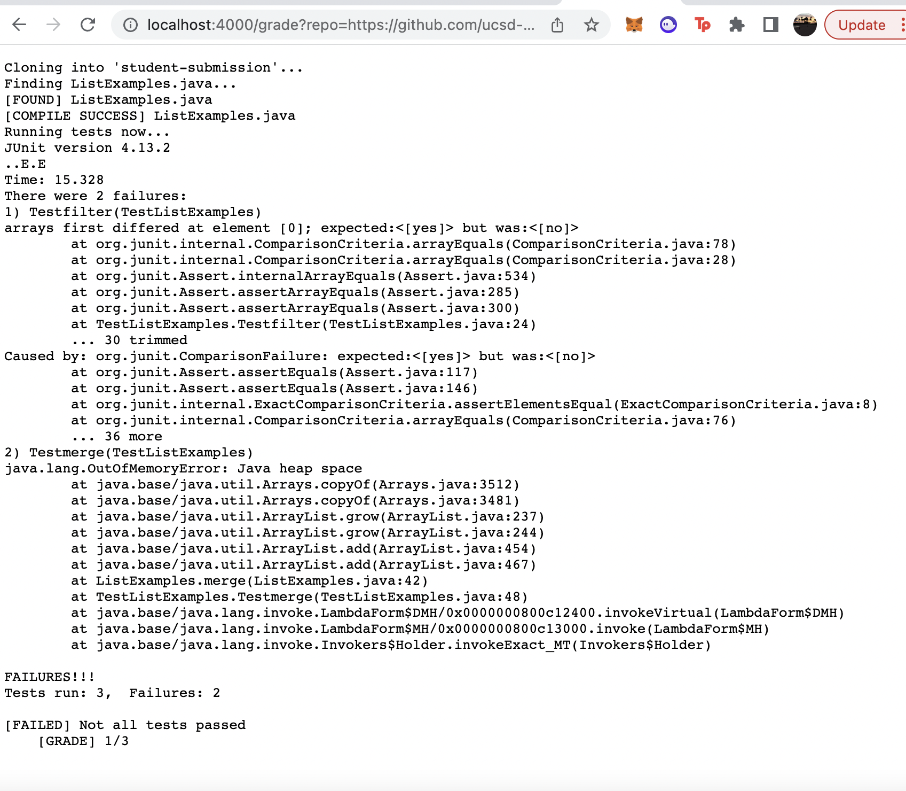
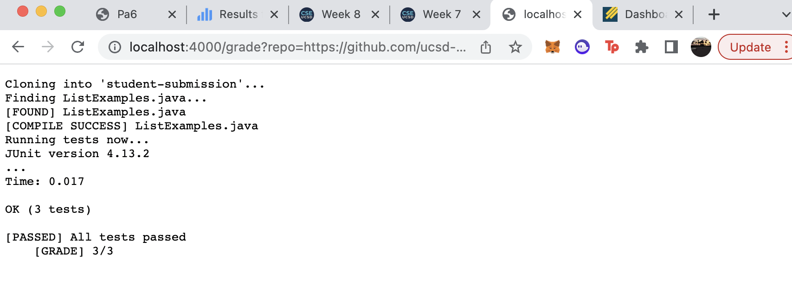
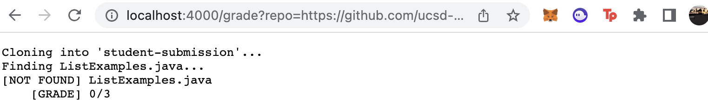

# **Lab Report 5** #
During this week's lab report we created a bash script capable of grading a student's submission for a given assignment. This bash script also will 
return feedback for the student and provide them with a grade for the work they submitted. 
___

## **Bash Script** ##
```
set -e

rm -rf student-submission
git clone $1 student-submission 

FILE="ListExamples.java"

echo "Finding $FILE..."
cd student-submission

# Checks if file exists
if test -f "$FILE"; 
then 
    echo "[FOUND] ListExamples.java "
else 
    echo "[NOT FOUND] ListExamples.java
    [GRADE] 0/3"
    exit
fi
cd ..

# Copy tests into student submission
cp "TestListExamples.java" student-submission

# Check if the file compiles
javac -cp .:lib/hamcrest-core-1.3.jar:lib/junit-4.13.2.jar ./student-submission/*.java
if [ $? -eq 0 ]; 
then
    echo "[COMPILE SUCCESS] $FILE"
else 
    echo "[COMPILE FAILURE] $FILE
    [GRADE] 0/3" 
    exit
fi

set +e

# Run tests
echo "Running tests now..."

cd student-submission
java -cp .:../lib/hamcrest-core-1.3.jar:../lib/junit-4.13.2.jar org.junit.runner.JUnitCore TestListExamples 
if [ $? -eq 0 ];
then
    echo "[PASSED] All tests passed
    [GRADE] 3/3"
else 
    echo "[FAILED] Not all tests passed 
    [GRADE] 1/3"
fi
```
---
## **Testing Different Submissions** ##

Student 1: This was the output for: https://github.com/ucsd-cse15l-f22/list-methods-lab3


Student 2: This was the output for: https://github.com/ucsd-cse15l-f22/list-methods-corrected


Student 3: This was the output for: https://github.com/ucsd-cse15l-f22/list-methods-filename

___

## **Trace of Script for Student 3** ##

**Line 3** uses the set command who's stdOut allows the program to run and who's stdErr instantly quits the script in the event of an error. It's return code was 0. 

**Line 5** stdOut is removing the student-submission file and stdErr is that no file is present. It's return code was 0. 

**Line 6** stdOut is cloning student 3's submission, stdErr is that no repository exists. It's return code was 0.

**Line 8** creates the FILE variable that contains `ListExamples.java`. It's return code was 0. 

**Line 10** lets us know that the program is looking for `ListExample.java` within student 3's submission. This echo command has an exit code of 0. 

**Line 11** changes the directory to student 3's submission directory as its stdOut. It's stdErr was if there was no student-submission directory, however since there was the exit code returned is 0. 

**Line 14** checks student 3's submission directory for a file named `ListExample.java`. This if statement will return `false` since student 3 misnamed his file and it does not match `ListExample.java`. As a result of this if statement, **Lines 15 and 16** will not run. 

**Line 17-Line 19** since the if statement returned false, the `else` condition runs and the echo command notifies the grader that the file was not found and the student will be receiving a `0/3` for the assignment. All of these commands have an exit code of 0. 

**Line 20** since the `else` condition ran and the student's submission was already graded, the bash script will run the `exit` command and stdOut will exit the script. 

**Lines 21 - 52** will not run since the bash script exits at **line 20**. 

My feedback for student submission #3 is to be more careful when naming files!

